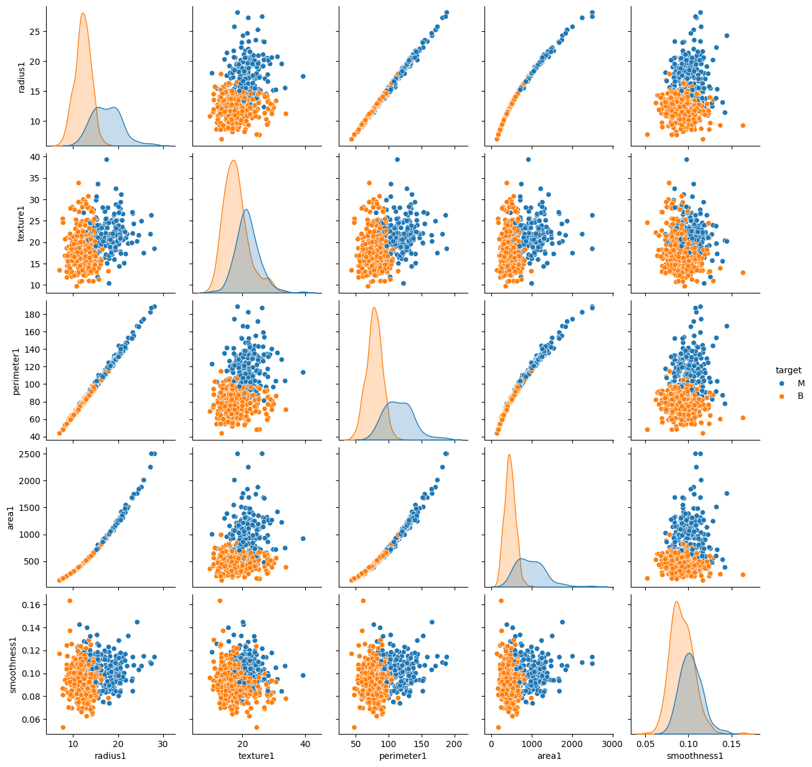
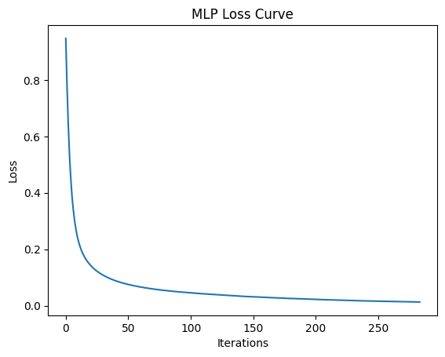
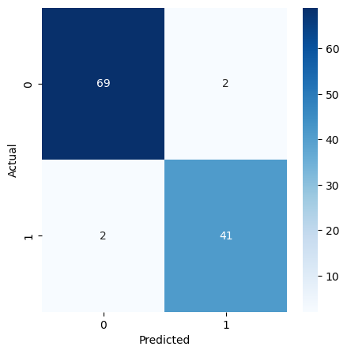

# 🩺 Breast Cancer Classification using Logistic Regression

## 📌 Overview
This project implements **Logistic Regression** for binary classification using the Breast Cancer Wisconsin dataset.  
The objective is to predict whether a tumor is **malignant** or **benign** using clinical measurement features.

This project demonstrates how probabilistic linear models can be applied in medical diagnosis prediction.

---

## 🧠 Model Used
- **Algorithm:** Logistic Regression  
- **Type:** Binary Classification  
- **Optimization:** Maximum Likelihood Estimation  
- **Library:** scikit-learn  

---

## 📊 Dataset

- **Dataset:** Breast Cancer Wisconsin Dataset  
- **Source:** scikit-learn built-in dataset  
- **Total Samples:** 569  
- **Total Features:** 30 numerical tumor-related features  

### Target Classes:
- `0` → Malignant  
- `1` → Benign  

The dataset contains tumor measurement features such as:
- Radius
- Texture
- Perimeter
- Area
- Smoothness
- Compactness
- Concavity
- Fractal Dimension  
(and other derived features)

---
## 📦 Requirements

```bash
pip install numpy pandas matplotlib seaborn scikit-learn
```
---

## 🔍 Machine Learning Pipeline

1. Data Loading  
2. Data Exploration  
3. Feature Scaling using `StandardScaler`  
4. Train-Test Split  
5. Model Training using Logistic Regression  
6. Model Evaluation:
   - Accuracy
   - Precision & Recall
   - Classification Report
   - Confusion Matrix
   - ROC Curve & AUC Score  

---

## 📈 Results

- High classification accuracy  
- Strong precision and recall  
- High ROC-AUC score indicating strong model discrimination capability  
- Effective separation between malignant and benign tumors  

---

## 📊 Visualizations

### ✅ Results









---

## 🎯 Project Objective

The goal of this project is to:
- Understand probabilistic linear models
- Apply Logistic Regression to real-world medical data
- Evaluate classification performance using multiple metrics
- Interpret model effectiveness in healthcare analytics

---

## 🛠 Technologies Used

- Python  
- NumPy  
- Pandas  
- Matplotlib  
- Seaborn  
- scikit-learn  

---

## 🚀 How to Run

### Clone the repository:

```bash
git clone https://github.com/your-username/breast-cancer-classification-logistic-regression.git
```

### Navigate to the project folder:

```bash
cd breast-cancer-classification-logistic-regression
```

### Open the notebook:

```bash
jupyter notebook
```


